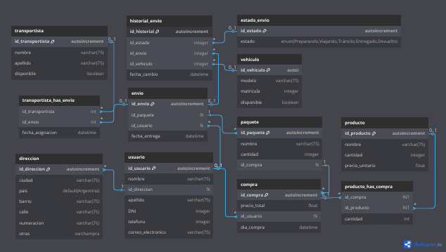

# Modelo de Base de Datos – Sistema de Gestión de Envíos 📦

Proyecto académico de modelado y programación de una base de datos relacional para un sistema de gestión de compras y envíos.  
Pensado para demostrar uso de **MySQL**, **stored procedures**, **funciones**, **triggers**, **transacciones** y **vistas**.

---

## 🧩 Descripción del proyecto

El sistema modela un flujo completo desde la compra de productos hasta la entrega al cliente:

- Gestión de productos y stock
- Registro de compras y detalle de productos comprados
- Armado de paquetes asociados a compras
- Asignación de transportistas y vehículos a envíos
- Seguimiento del estado de los paquetes  
  (Preparando → Viajando → Tránsito → Entregado)

Este proyecto está compuesto por tres archivos principales:

- [Tablas.sql](cci:7://file:///e:/_DATOS%20USUARIO/Desktop/Analista%20de%20sistemas/4to%20cuatrimestre/1%29%20BD_3/FINAL_BD3/Tablas.sql:0:0-0:0)  
  Definición del esquema de la base de datos:
  - Tablas de negocio: `producto`, `compra`, `usuario`, `paquete`, `envio`,
    `transportista`, `vehiculo`, `estado_envio`, etc.
  - Tablas intermedias: `producto_has_compra`, `transportista_has_envio`
  - Tabla de auditoría: `actualizacion_stock_audit`

- [Datos.sql](cci:7://file:///e:/_DATOS%20USUARIO/Desktop/Analista%20de%20sistemas/4to%20cuatrimestre/1%29%20BD_3/FINAL_BD3/Datos.sql:0:0-0:0)  
  Inserción de datos de ejemplo:
  - Productos con stock y precios
  - Usuarios, compras y paquetes
  - Transportistas, vehículos y estados de envío
  - Casos pensados para probar procedimientos, funciones y vistas

- [funciones.sql](cci:7://file:///e:/_DATOS%20USUARIO/Desktop/Analista%20de%20sistemas/4to%20cuatrimestre/1%29%20BD_3/FINAL_BD3/funciones.sql:0:0-0:0)  
  Lógica de negocio en la base:
  - **Funciones**:
    - `fn_stock_producto(nombre)` → devuelve el stock actual de un producto.
    - `fn_estado_actual_paquete(nombre_paquete)` → devuelve el estado actual del paquete.
    - `fn_precio_compra(producto, cantidad)` → calcula el precio total validando stock disponible.
  - **Triggers**:
    - `trg_stock_producto_audit` → audita cambios de stock en `producto` y guarda quién, cuándo y cuánto modificó.
  - **Stored Procedures**:
    - `sp_registrar_compra(usuario, producto, cantidad, OUT total)`  
      Registra una compra completa (cabecera, detalle, actualización de stock) usando transacciones y manejo de errores.
    - `sp_armar_paquete(nombre_paquete, cantidad, id_compra)`  
      Crea el paquete asociado a una compra existente.
    - `sp_registrar_envio(transportista, matricula, paquete, OUT fecha_entrega)`  
      Asigna transportista y vehículo disponibles, genera el envío y registra historial de estados.
    - `sp_avanzar_estado_envio(estado_actual)`  
      Avanza masivamente los envíos de un estado al siguiente  
      (Preparando → Viajando → Tránsito → Entregado).
  - **Vistas**:
    - `vw_productos_mas_vendidos` → ranking de productos según cantidad vendida.
    - `vw_historico_compras_usuario` → cantidad de compras por usuario.
    - `vw_stock_bajo` → productos con stock por debajo de un umbral.
    - `vw_estado_actual_paquetes` → estado actual de todos los paquetes, con usuario y transportista.

---

## 🗺️ Diagramas del modelo de datos

A continuación se presentan los diagramas del modelo de base de datos utilizados en el proyecto.

### Diagrama entidad–relación (general)



---

## 🛠️ Tecnologías utilizadas

- **Motor de Base de Datos**: MySQL / MariaDB
- **Lenguaje**: SQL (DDL, DML y programación de stored procedures)
- **Conceptos clave**:
  - Claves primarias y foráneas
  - Tablas intermedias para relaciones N:M
  - Funciones y stored procedures
  - Triggers de auditoría
  - Transacciones y manejo de errores (`SQLEXCEPTION`, `NOT FOUND`, `SIGNAL SQLSTATE`)
  - Vistas para reporting y consultas de negocio

---

## 🚀 Cómo ejecutar el proyecto

1. Crear una base de datos nueva en MySQL:

   ```sql
   CREATE DATABASE modelo_envios;
   USE modelo_envios;
   ```_

2. Ejecutar los scripts en este orden:

Tablas.sql  –  Datos.sql  –  funciones.sql

3. Probar algunos casos de uso (incluidos al final de cada script):
Consultar stock de un producto:
    ```sql
    SELECT fn_stock_producto('Casco de seguridad industrial');
    ```_  
       
Registrar una compra:
    ```sql
       CALL sp_armar_paquete('Paquete_001', 2, 1);
    CALL sp_registrar_envio('Juan', '2002', 'Paquete_001', @fecha_entrega);
    SELECT @fecha_entrega;
     ```_    

Armar un paquete y asignar un envío:
    ```sql
    CALL sp_armar_paquete('Paquete_001', 2, 1);
    CALL sp_registrar_envio('Juan', '2002', 'Paquete_001', @fecha_entrega);
    SELECT @fecha_entrega;
    ```_
    
Avanzar estado de todos los envíos en “Preparando”:
    ```sql
    CALL sp_avanzar_estado_envio('Preparando');
     ```_

## 🎯 Objetivo del proyecto

EL objetivo de este repo es realizar un diseño de modelo relacional para un sistema realista de compras y 
envíos e implementación de lógica de negocio en la capa de base de datos.

Buenas prácticas de: Uso de transacciones, manejo de errores controlado, auditoría de cambios, y vistas para análisis de datos.

📬 Contacto
Autor: Franco Goslino
GitHub: @FrancoGoslino
